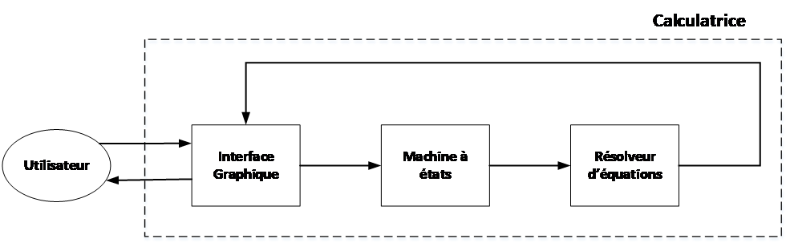
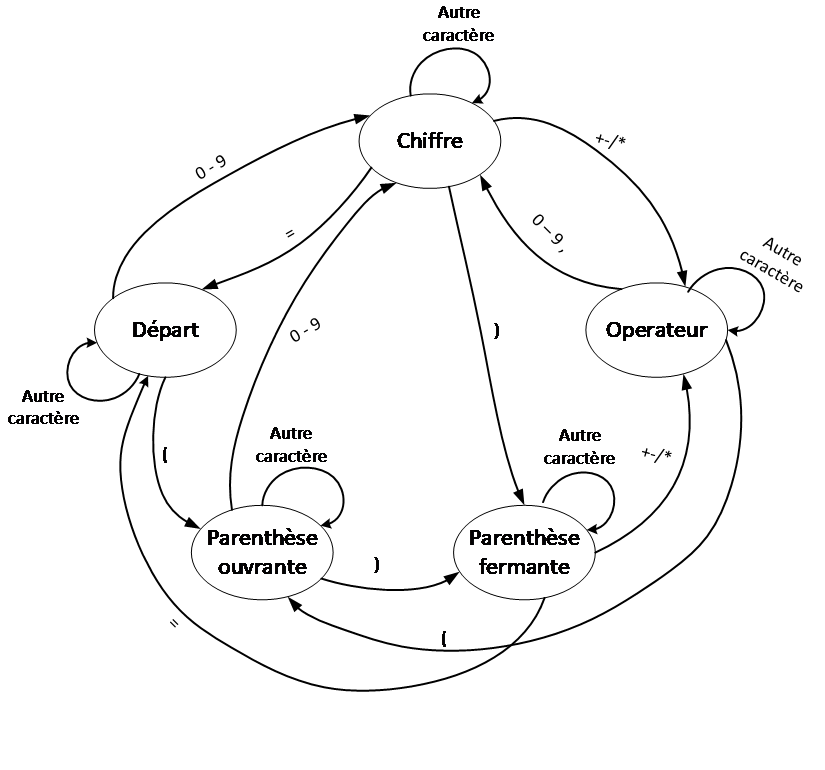
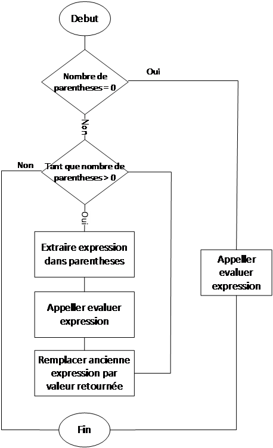

Calculatrice De Bureau Simple (CDBS) – Architecture interne
============================================================

+--------------------------+--------------------------------------+
| **Auteur(s)**            | Alexandre Cox & Pierre-Marc Laforest |
+==========================+======================================+
| **Éditeur**              | Alexandre Cox & Pierre-Marc Laforest |
+--------------------------+--------------------------------------+
| **Date de création**     | 24 Janvier 2018                      |
+--------------------------+--------------------------------------+
| **Dernière mise à jour** | 07 Mars 2018                         |
+--------------------------+--------------------------------------+
| **Statut**               | Version préliminaire                 |
+--------------------------+--------------------------------------+
| **Version**              | **0.2**                              |
+--------------------------+--------------------------------------+

Historique des versions

+-----------------+-----------------+-----------------+-----------------+
| **Date**        | **Version**     | **Auteur**      | **Modification**|
|                 |                 |                 |                 |
| (jj-mm-aaaa)    |                 |                 |                 |
+=================+=================+=================+=================+
| 24-01-2018      | 0.1             | Pierre-Marc     | Création        |
|                 |                 | Laforest        | initiale du     |
|                 |                 |                 | document.       |
+-----------------+-----------------+-----------------+-----------------+
| 07-02-2018      | 0.2             | Alexandre Cox & | Mise à jour des |
|                 |                 |                 | spécifications  |
|                 |                 | Pierre-Marc     | et de la        |
|                 |                 | Laforest        | présentation de |
|                 |                 |                 | l’interface.    |
+-----------------+-----------------+-----------------+-----------------+

Abréviations/acronymes

+-----------------------------------+-----------------------------------+
| **Abré./Acron**                   | **Définition**                    |
+===================================+===================================+
| Opération arithmétique simple     | Une expression mathématique ne    |
|                                   | contenant que des nombres réels,  |
|                                   | des parenthèses, et des           |
|                                   | opérations parmi les suivantes :  |
|                                   | addition, soustraction,           |
|                                   | multiplication, division.         |
+-----------------------------------+-----------------------------------+
| CDBS                              | Calculatrice De Bureau Simple.    |
|                                   | Fait référence au logiciel.       |
+-----------------------------------+-----------------------------------+

Table des matières
==================

`1. Introduction 3 <#introduction>`__

`CDBS-INTRO-001. Description générale du système
3 <#cdbs-intro-000.-description-générale-du-système>`__

`2. Interface graphique 4 <#interface-graphique>`__

`CDBS-INTF-000. Description générale
4 <#cdbs-intf-000.-description-détaillée>`__

`3. La machine à états 5 <#la-machine-à-états>`__

`CDBS-MAE-000. Description générale
5 <#cdbs-mae-000.-description-détaillée>`__

`4. Le résolveur d’équations 6 <#le-résolveur-déquations>`__

`CDBS-RE-000. Description générale
6 <#cdbs-re-000.-description-détaillée>`__

Introduction
============

CDBS-INTRO-000. Description générale du système
-----------------------------------------------

Le document suivant contient les informations nécessaires à la
compréhension de la structure interne du programme de la calculatrice.
Afin de respecter les bonnes pratiques de développement logiciel, la
calculatrice a été développée à l’aide d’une approche modulaire. La
figure qui suit illustre et explique son fonctionnement. Comme on peut
le constater sur cette figure, la calculatrice n’est rien d’autre qu’un
assemblage de trois modules aux tâches bien définies.

Ces trois modules sont :

L\ **’interface graphique** permet à l’utilisateur d’entrer une équation
dans la calculatrice.

La **machine à états** conserve l’état en cours d’exécution du
programme.

Le **résolveur d’équations** qui résout les équations entrées par
l’utilisateur.

|image0|

Interface graphique
===================

CDBS-INTF-000. Description détaillée
------------------------------------

L’interface graphique est le module qui contient toutes les fonctions
reliées aux entrées/sorties vers l’utilisateur. En réalité, ce module a
deux tâches principales :

1. Permettre à l’utilisateur d’entrer une équation.

2. Afficher le résultat d’une équation.

Lorsque l’utilisateur appuie sur des touches au clavier ou clique sur
des boutons de l’interface, ce composant reçoit l’équivalent ascii du
caractère entré. Le travail de l’interface graphique consiste ensuite à
envoyer ces caractères au module suivant, qui se trouve à être la
machine à états.

La deuxième tâche du programme consiste à afficher les résultats des
équations, une fois celles-ci calculées. De plus, les résultats sont
présentés avec une précision de deux chiffres après le point.

La machine à états
==================

CDBS-MAE-000. Description détaillée
-----------------------------------

La machine à états et la deuxième partie du programme de calculatrice.
Les commandes entrées par l’usager sont dirigées vers ce module. La
tâche de ce module consiste à décider de passer à un état suivant si
l’entrée est considérée comme valide. La figure de cette section
illustre les états possibles ainsi que les différentes commandes qui
permettent de passer d’un état à un autre. Il est intéressant de noter
que cette machine applique le principe *du fail-safe default*, et
n’autorise qu’un certain nombre de transitions pour changer d’états. Si
les caractères entrés ne correspondent pas à une transition valide, les
états “bouclent” sur eux-mêmes (voir figure).

|image1|

Le résolveur d’équations
========================

CDBS-RE-000. Description détaillée
----------------------------------

Le résolveur d’équation intervient lorsque l’utilisateur a entré une
équation valide puis a appuyé sur le signe d’égalité. L’entrée d’un
signe d’égalité, appelle le résolveur d’équations et remet la machine à
états à son état initial. L’algorithme du résolveur d’équation est
illustré à la figure 3. Le principe en arrière de cet algorithme est
simple : on divise l’équation en sous-expressions, lesquels sont
délimités par des parenthèses, puis on évalue ces sous-expressions.
Lorsque l’expression ne contient plus ou pas de parenthèses, le
résolveur évalue l’expression puis retourne le résultat.

|image2|

