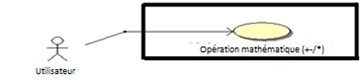
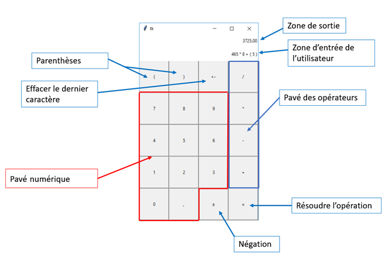

Calculatrice De Bureau Simple (CDBS) – Spécifications techniques
=================================================================

+--------------------------+--------------------------------------+
| **Auteur(s)**            | Alexandre Cox & Pierre-Marc Laforest |
+==========================+======================================+
| **Éditeur**              | Alexandre Cox & Pierre-Marc Laforest |
+--------------------------+--------------------------------------+
| **Date de création**     | 24 Janvier 2018                      |
+--------------------------+--------------------------------------+
| **Dernière mise à jour** | 07 Mars 2018                         |
+--------------------------+--------------------------------------+
| **Statut**               | Version préliminaire                 |
+--------------------------+--------------------------------------+
| **Version**              | **0.4**                              |
+--------------------------+--------------------------------------+

Historique des versions

+-----------------+-----------------+-----------------+-----------------+
| **Date**        | **Version**     | **Auteur**      | **Modification**|
|                 |                 |                 |                 |
| (jj-mm-aaaa)    |                 |                 |                 |
+=================+=================+=================+=================+
| 24-01-2018      | 0.1             | Alexandre Cox   | Création        |
|                 |                 |                 | initiale du     |
|                 |                 |                 | document.       |
+-----------------+-----------------+-----------------+-----------------+
| 07-02-2018      | 0.2             | Alexandre Cox & | Mise à jour des |
|                 |                 |                 | spécifications  |
|                 |                 | Pierre-Marc     | et de la        |
|                 |                 | Laforest        | présentation de |
|                 |                 |                 | l’interface.    |
+-----------------+-----------------+-----------------+-----------------+
| 21-02-2018      | 0.3             | Alexandre Cox   | Exigences       |
|                 |                 |                 | Windows         |
+-----------------+-----------------+-----------------+-----------------+
| 07-03-2018      | 0.4             | Pierre-Marc     | Corrections     |
|                 |                 | Laforest        | mineures        |
|                 |                 |                 | (fautes et mise |
|                 |                 |                 | en page).       |
|                 |                 |                 | Changement au   |
|                 |                 |                 | niveau des      |
|                 |                 |                 | spécifications  |
|                 |                 |                 | F et NF.        |
+-----------------+-----------------+-----------------+-----------------+

Abréviations/acronymes

+-----------------------------------+-----------------------------------+
| **Abré./Acron**                   | **Définition**                    |
+===================================+===================================+
| Opération arithmétique simple     | Une expression mathématique ne    |
|                                   | contenant que des nombres réels,  |
|                                   | des parenthèses, et des           |
|                                   | opérations parmi les suivantes :  |
|                                   | addition, soustraction,           |
|                                   | multiplication, division.         |
+-----------------------------------+-----------------------------------+
| CDBS                              | Calculatrice De Bureau Simple.    |
|                                   | Fait référence au logiciel.       |
+-----------------------------------+-----------------------------------+

Table des matières
===================

`1. Introduction <#introduction>`__

`CDBS-INTRO-001. Objectif <#cdbs-intro-001-objectif>`__

`CDBS-INTRO-002. Portée <#cdbs-intro-002-portee>`__

`CDBS-INTRO-003. Définition <#cdbs-intro-003-definition>`__

`CDBS-INTRO-004. Hypothèses et Dépendances
3 <#cdbs-intro-004-hypothèses-et-dependances>`__

`2. Cas d’utilisation <#cas-dutilisation>`__

`CDBS-CSU-000. Effectuer une opération mathématique simple
4 <#cdbs-csu-000-effectuer-une-operation-mathematique-simple>`__

`3. Les Acteurs <#les-acteurs>`__

`CDBS-ACT-001. Dirigeant(e) <#cdbs-act-001-dirigeante>`__

`CDBS-ACT-002. Secrétaire <#cdbs-act-002-secretaire>`__

`CDBS-ACT-003. Comptable <#cdbs-act-003-comptable>`__

`CDBS-ACT-004. Homme d’entrepôt <#cdbs-act-004-homme-dentrepot>`__

`4. Les exigences <#les-exigences>`__

`CDBS-EF. Les exigences fonctionnelles
6 <#cdbs-ef-les-exigences-fonctionnelles>`__

`CDBS-ENF. Les exigences non fonctionnelles
6 <#cdbs-enf-les-exigences-non-fonctionnelles>`__

`5. Interface 8 <#interface>`__

`CDBS-IU. Interfaces utilisateur 8 <#cdbs-iu-interfaces-utilisateur>`__

`6. Annexe A 9 <#annexe-a>`__

Introduction
============

CDBS-INTRO-001. Objectif
------------------------

L’objectif de ce document est d’exposer le comportement externe du
logiciel Calculatrice De Bureau Simple (CDBS) du point de vue de
l’utilisateur. Il présente avec minutie une liste des exigences
fonctionnelles et non fonctionnelles. Ce document constitue une vue
globale du système CDBS en tenant compte des acteurs et des cas
d'utilisation.

CDBS-INTRO-002. Portée
----------------------

Le logiciel CDBS a été conçu pour être un outil aux utilisateurs ayant
besoin d’effectuer des opérations arithmétiques utilisant les opérateurs
de base (+, -, \*, /). Le logiciel CDBS permet d’effectuer ces
opérations plus rapidement que si elle était faite à la main, facilitant
et accélérant le calcul via une interface.

CDBS-INTRO-003. Définition
--------------------------

**Opération arithmétique simple**

Une expression mathématique ne contenant que des nombres réels, des
parenthèses, et des opérateurs parmi les suivant : addition,
soustraction, multiplication, division.

CDBS-INTRO-004. Hypothèses et Dépendances
-----------------------------------------

Pour réaliser ce logiciel, nous devons assumer certaines hypothèses. Ces
dernières peuvent se résumer comme suit :

1. Nous présumons qu’il n’y aura pas de changement au niveau des
   exigences qui pourrait avoir un impact considérable sur le
   développement de ce logiciel.

2. Nous présumons qu’il n’y aura pas de changement de hardware/software
   qui pourrait avoir un impact sur le développement de ce logiciel.

3. Tout changement approuvé dans le document de vision aura un impact
   sur ce document.

Cas d’utilisation
=================

Vous trouverez ici un résumé des cas d’utilisation. Les cas
d’utilisation détaillés se trouvent en annexe A.

CDBS-CSU-000. Effectuer une opération mathématique simple
---------------------------------------------------------

|image0|

**Description**

L’utilisateur veut résoudre une opération arithmétique simple en entrant
une expression dans l’interface utilisateur. Il souhaite également
pouvoir lire le résultat correspondant dans la fenêtre prévue à cet
effet.

Les Acteurs
===========

CDBS-ACT-001. Dirigeant(e)
--------------------------

Le/la dirigeant(e) est un utilisateur qui se sert du logiciel afin de
résoudre de simples opérations arithmétiques.

Le/la dirigeant(e) pourrait avoir besoin d’utiliser la CDBS pour :

-  Un calcul impliquant un montant d’argent.

-  Un calcul impliquant des articles (inventaire ou commande).

-  Un calcul impliquant un nombre de personnes.

-  Un autre calcul arithmétique simple.

CDBS-ACT-002. Secrétaire
------------------------

Le/la secrétaire est un utilisateur qui se sert du logiciel afin de
résoudre de simples opérations arithmétiques. De plus, en raison de la
nature de son travail, le/la secrétaire risque de commettre des erreurs
lors des entrées au clavier.

Le/la secrétaire pourrait avoir besoin d’utiliser la CDBS pour :

-  Un calcul impliquant un montant d’argent.

-  Un calcul impliquant des articles (commande).

-  Un autre calcul arithmétique simple.

CDBS-ACT-003. Comptable
-----------------------

Le/la comptable est un utilisateur qui se sert du logiciel afin
d’effectuer principalement des opérations impliquant des montants en
argent. Cet utilisateur demande que la CDBS retourne des résultats ayant
une précision de deux chiffres après le point.

Il pourrait avoir besoin d’utiliser la CDBS pour :

-  Un calcul impliquant un montant d’argent.

-  Un autre calcul arithmétique simple.

CDBS-ACT-004. Homme d’entrepôt
------------------------------

L’homme d’entrepôt est un utilisateur qui se sert principalement du
logiciel pour des calculs impliquant l’inventaire. Cet homme exige un
système qui est facile à utiliser puisqu’il doit effectuer des
opérations de manutention la majorité du temps.

Il pourrait avoir besoin d’utiliser la CDBS pour :

-  Un calcul impliquant des articles (inventaire ou commande).

-  Un autre calcul arithmétique simple.

Les exigences
=============

CDBS-EF. Les exigences fonctionnelles
-------------------------------------

**CDBS-EF-000.** Le logiciel doit posséder une interface graphique
comprenant des boutons pour les chiffres 0 à 9, des opérateurs +-*/, des
parenthèses ainsi qu’un signe d’égalité.

**CDBS-EF-001.** Le logiciel doit posséder une interface graphique
comprenant des boutons pour permettre d’effacer un caractère,
d’effectuer une négation de nombre, d’entrer des nombres à virgules.

**CDBS-EF-002.** Le calcul exact d’une expression mathématique
impliquant les opérateurs de base +, -, / et \*, des parenthèses, des
nombres négatifs, des nombres rationnels.

**CDBS-EF-003.** Retourner un résultat ayant une précision de deux
chiffres après le point.

**CDBS-EF-004.** Prévenir les erreurs qui sont détectable au moment de
l’entrée d’un caractère.

**CDBS-EF-005.** Retourner un message d’erreur lorsque l’expression
entrée provoque une erreur lors de la résolution et, si possible,
catégoriser l’erreur.

**CDBS-EF-006.** Pouvoir effacer un caractère de l’entrée courante.

**CDBS-EF-007.** Afficher les caractères de l’expression courante à
mesure qu’ils sont entrés.

**CDBS-EF-008.** Prendre les entrées au clavier ou à partir de cliques
souris sur l’interface.

**CDBS-EF-009.** Lorsque l’utilisateur demande un total, afficher le
résultat de l’expression au-dessus de l’expression courante.

**CDBS-EF-010.** Lorsque le logiciel retourne une erreur, l’afficher à
la place du résultat pour en aviser l’utilisateur.

CDBS-ENF. Les exigences non fonctionnelles
------------------------------------------

**CDBS-ENF-000.** Le logiciel doit pouvoir être utilisé en alternance
avec le clavier et/ou la souris et doit avoir une sortie identique dans
les deux cas.

**CDBS-ENF-001.** L’interface doit être intuitive. Les boutons de
l’interface doivent être bien visibles et disposés de manière
cohérente\ **.**

**CDBS-ENF-002.** Le logiciel doit continuer de fonctionner lorsqu’une
erreur est rencontrée lors de la résolution de l’opération arithmétique
simple.CDBS-ENF-001. Facilité d’utilisation

**CDBS-ENF-003.** Le logiciel doit être utilisé sur un ordinateur
personnel (PC).

**CDBS-ENF-004.** Le logiciel doit être codé avec le langage Python
(Version 3.x).

**CDBS-ENF-005.** L’interface du logiciel doit utiliser la bibliothèque
graphique Tkinter.

**CDBS-ENF-006.** Le logiciel peut être lancé par un .exe Windows, ou à
partir des .py avec un interpréteur python 3.x.

**CDBS-ENF-007.** Tous les documents exigences et spécifications doivent
être rédigés en français.

**CDBS-ENF-008.** Le présent document doit être livré au client au même
titre que le système lors du déploiement.

Interface
=========

CDBS-IU. Interfaces utilisateur
-------------------------------

**CDBS-IU-001 :**

**Cas d’utilisation associé(s) : CDBS-CSU-000**

La figure suivante détaille l’interface qui permettra à l’utilisateur
d’entrer l’opération à résoudre par le logiciel CDBS et d’en obtenir la
réponse.

|image1|

Annexe A
========

**CDBS-CSU-000. Effectuer une opération mathématique simple**

**Précondition**

-  Avoir le programme ouvert et en focus. (Le programme est en focus à
   l’ouverture ou peut être mis en focus en cliquant sur l’interface)

**Flux d’événements de bases**

-  L’utilisateur entre une expression en la tapant au clavier, ou en
   cliquant sur les boutons correspondant de l’interface. Les caractères
   apparaissent sur l’écran du CDBS à mesure qu’ils sont entrés.

-  L’utilisateur demande un total avec le caractère « = » (égale).

-  Si l’expression ne contient pas d’erreurs, l’expression résolu
   apparait au-dessus de l’expression entrée.

**Flux d’événements alternatif**

    **1a.** **Le CDBS reconnait une expression invalide à l’entrer**

1. **L’utilisateur tente d’entrer un caractère invalide**

    Le CDBS n’enregistrera pas un caractère autre que
    nombre/opérateur/parenthèse.

2. **L’utilisateur tente d’entrer une suite invalide de caractères
   valide**

   -  Si l’utilisateur entre plusieurs opérateurs, le CDBS ne gardera
      que le dernier entrer.

   -  Si l’utilisateur entre une parenthèse fermente, il doit d’abord y
      avoir eu une parenthèse ouvrante.

   -  Si l’utilisateur n’entre pas un nombre après un point ‘.’ décimal,
      le CDBS ajoute automatiquement un zéro après le point.

   -  Le CDBS insère un zéro si l’utilisateur ferme une parenthèse vide.

    **2a. Le CDBS retrouve des parenthèses non fermées à la demande du
    total**

-  Si l’utilisateur entre des parenthèses ouvrantes sans les fermer, le
   CDBS les fermes automatiquement.

    **3a. Le CDBS reconnait une expression invalide à la résolution**

1. **Le CDBS reconnait l’erreur de syntaxe**

   -  Le CDBS retourne un message d’erreur spécifiant l’erreur. Par
      exemple, lorsqu’une expression contient une division par zéro.

2. **Les CDBS ne reconnait pas l’erreur**

   -  Le CDBS envoie à l’écran le message « Entrée invalide » lorsqu’une
      erreur de syntaxe non-reconnu à empêcher la résolution de
      l’expression. Ce message est également envoyé à l’interface
      lorsqu’une erreur d’application non gérer a été reçu (Rare).

